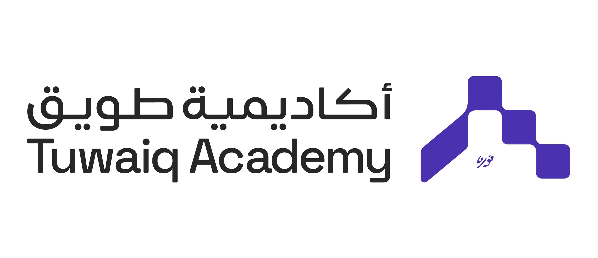
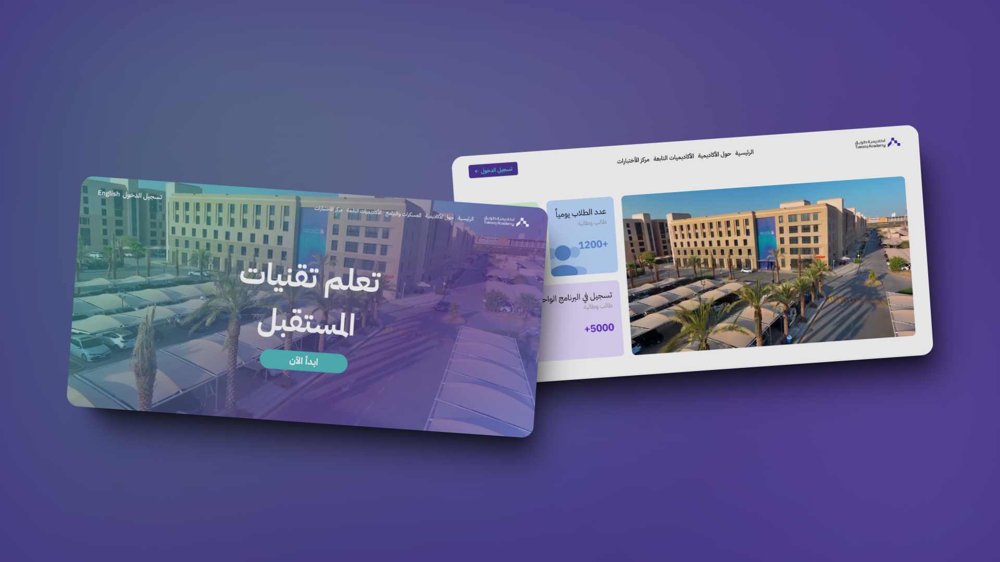

  

## 📂 Table of Contents

- [📋 Project Description](#-project-description)
- [✨ Features](#-features)
- [⛏️ Built Using](#️-built-using)
  - [Frontend](#frontend)
  - [Assets](#assets)
- [🔍 Explore The Project](#-explore-the-project)
- [📥 Installation](#-installation)
- [✍ Contributors](#-contributors)
- [💳 License](#-license)
- [🏅Acknowledgments](#acknowledgments)

## 📋 Project Description

A clone website for Tuwaiq academy using HTML and CSS for my internship as Full Stack Developer

  

## ✨ Features

- Clean and visually appealing layout
- Responsive design
- Interactive
- Easy navigation
- Contain 2 pages
  - Home
  - About

## ⛏️ Built Using

### Frontend

### Assets

- [Tuwaiq Academy](https://tuwaiq.edu.sa/)

## 🔍 Explore The Project

- [Tuwaiq Academy Clone](https://mohammed-dhabaab.github.io/tuwaiq-academy-clone/index.html)

## 📥 Installation

1. Clone the project or download the zip version of the project than unzip it
2. Open the index.html file on your browser

## ✍ Contributors

- Mohammed Dhabaab
  - [Website](https://mohammeddhabaab.com/)
  - [Github](https://github.com/mohammed-dhabaab)

## 💳 License

- [MIT](https://choosealicense.com/licenses/mit/)

## 🏅Acknowledgments
- [Tuwaiq Academy](https://mohammed-dhabaab.github.io/tuwaiq-adademy-clone/)
- [Trainer. Dimah Aldossari](https://github.com/Dimah-Aldossari)
- [Trainer. Ziad Alsaedi](https://github.com/ZiadAlsaedi)
